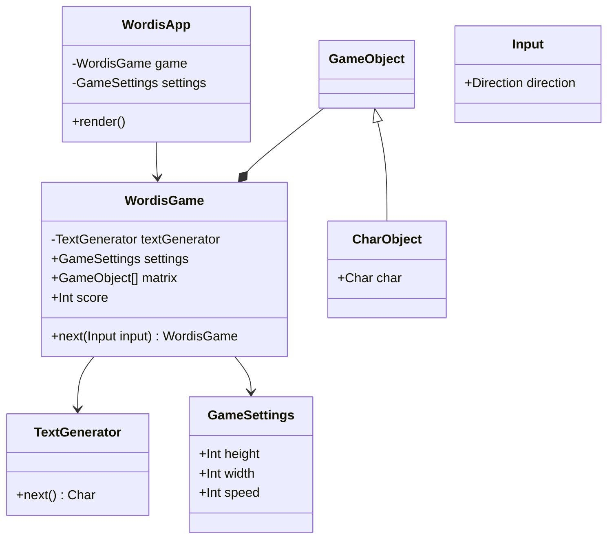

# Architecture

## Technology
- [Unity](https://unity.com/releases/2019-lts)
- [Block Puzzle Game Kit](https://assetstore.unity.com/packages/templates/packs/block-puzzle-game-kit-ready-to-publish-fun-mobile-game-162436)

## Design

### Note
The design below is speculative and might not fit Unity technical details.

### UML class diagram

