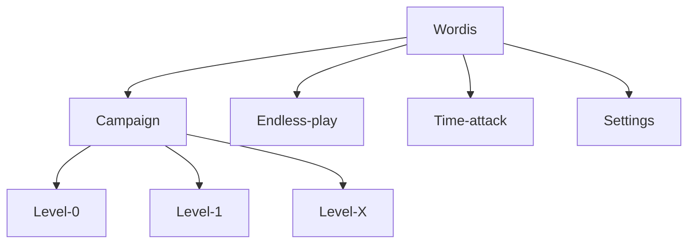
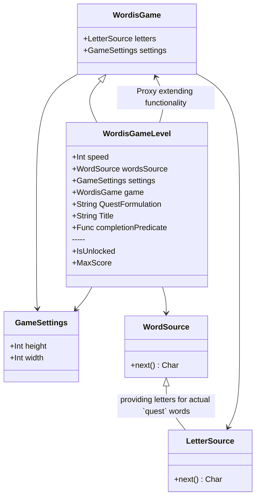

# Levels and Game modes

## Suggested game modes

### Campaign
This one is expected to be a primary level-based game mode.
See [Levels](###Campaign-levels)

### Endless
This is already implemented MVP

### Time-attack
Mode that is reasonable to have: match as many words in time limit

## Suggested game menu structure

## Campaign levels
### Level 0
    - Complete the `cat` automatically without the user input
    - Provide popup commentary on what is going on:
        - your goal is to match words
        - swipe right, left, or down
        - word is matched, you are hero!

### Level 1 (basic [palindromes](https://en.wiktionary.org/wiki/Appendix:English_palindromes#Three_letters))
    Use palindromes to simplify the goal
    - lol
	- wow
    - eve
	 -mom
	 -dad
	- gig
	- pop
	- pup
	- ewe
	- did
	- gig
	- bob

### Level 2 (4letter [palindromes](https://en.wiktionary.org/wiki/Appendix:English_palindromes#Four_letters))
	- anna
	- poop
	- deed
	- boob
	- esse
	- kook
	- noon

### Level 3 (Short animals)
possible goals:
1. match exact word
2. find N animals
	- cat
	- dog
	- rat
	- pup
	- pig
	- bee
	- cow
	- owl
	- fox
	- Bat
	- elk
	- Ant
	- Fly

### Level 4 (Longer animals)

### Level X (5letter [palindromes](https://en.wiktionary.org/wiki/Appendix:English_palindromes#Five_letters))
	-civic
	-madam
	-level
	-radar
	-refer

### Level X (Water mode)

## Levels(Modes) Technical design
